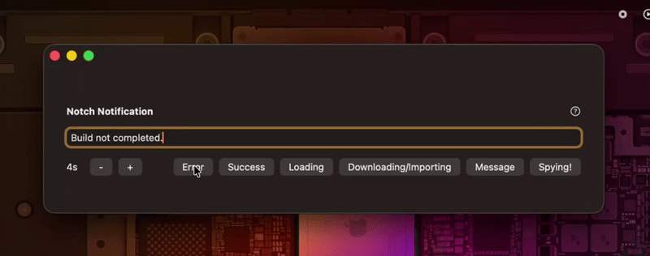

# NotchNotification Demo App

A simple demo showcasing the capabilities of the **NotchNotification** framework.

This macOS application demonstrates how developers can use the NotchNotification library to display custom notifications through the MacBook notch area, or anywhere on screen.

The original concept comes from [Lakr233](https://github.com/Lakr233/NotchNotification), but this demo specifically works with the enhanced version by [kingkwahli](https://github.com/kingkwahli), available [here](https://github.com/kingkwahli/NotchNotification).

---

## Quick Preview

---

## License

This project is licensed under the MIT License. See the [LICENSE](LICENSE) file for full details.

---

© 2024 Lakr Aream  
© 2025 Kwahli @ NaazimCo
